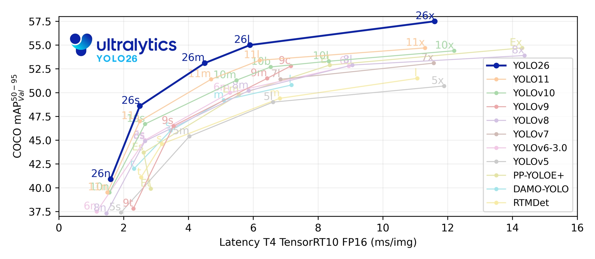

# Lakeside Motorbikes

Vehicle detection and alert system that monitors a Google Nest camera using [YOLO26](https://docs.ultralytics.com/models/yolo26/#overview) object detection and sends email alerts via Resend. Detects bicycles and motorcycles.



## Architecture

```
src/lakeside_motorbikes/
├── main.py                # Monitor orchestration & polling logic
├── cli.py                 # CLI argument parser (--backfill, --debug-dump)
├── config.py              # Pydantic settings from .env
├── camera/
│   ├── auth.py            # Google Nest auth via glocaltokens
│   ├── models.py          # CameraEvent dataclass (frozen)
│   └── nest_api.py        # Nest API client, MPEG-DASH XML parsing
├── detection/
│   ├── models.py          # Detection dataclass (frame, bbox, confidence, class_name)
│   ├── scooter_detector.py # Experimental: person tracking + centroid displacement
│   └── vehicle_detector.py # YOLO vehicle detection (classes 1,3), batched inference
├── notification/
│   └── email_sender.py    # Resend email: single alerts + backfill summary
└── utils/
    ├── daylight.py        # Sunrise/sunset filtering via astral
    ├── image.py           # ROI cropping & bounding box cropping with padding
    └── video.py           # MP4 frame extraction via OpenCV
```

## Setup

```bash
python3.12 -m venv .venv
source .venv/bin/activate
pip install -e ".[dev]"
cp .env.example .env  # then fill in credentials
```

## Running

```bash
python -m lakeside_motorbikes              # live monitoring (polls every 120s)
python -m lakeside_motorbikes --backfill   # analyze past 24 hours
python -m lakeside_motorbikes --backfill --debug-dump  # save clips as MP4s (cached)
python -m lakeside_motorbikes --scooter --backfill --debug-dump  # experimental scooter detection
```

Deployed as a macOS LaunchAgent via `com.lakeside-motorbikes.worker.plist`.

## Testing

```bash
pytest tests/
pytest tests/ -v --cov=src/lakeside_motorbikes
```

Tests use mocks for all external services (YOLO, Resend, Nest API). Test fixtures in `tests/fixtures/`.

## Code Quality

```bash
ruff check .    # lint (E, F, I rules)
ruff format .   # format (100 char line length)
mypy .          # type checking
```

## Environment Variables

See `.env.example` for the full list. Key variables:

| Variable | Default | Description |
|---|---|---|
| `GOOGLE_MASTER_TOKEN` | — | Google Nest master token |
| `GOOGLE_USERNAME` | — | Google account email |
| `NEST_DEVICE_ID` | — | Nest camera device ID |
| `RESEND_API_KEY` | — | Resend API key for email alerts |
| `ALERT_EMAIL_TO` | — | Recipient email address |
| `ALERT_EMAIL_FROM` | `alerts@xeroshot.org` | Sender email address |
| `CAMERA_LATITUDE` | — | Camera latitude (daylight filtering) |
| `CAMERA_LONGITUDE` | — | Camera longitude (daylight filtering) |
| `YOLO_MODEL` | `yolo26s.pt` | YOLO model weights file |
| `YOLO_CONFIDENCE_THRESHOLD` | `0.4` | Minimum confidence for alerts |
| `YOLO_BATCH_SIZE` | `16` | Frames per YOLO inference batch (prevents GPU OOM) |
| `CROP_PADDING` | `0.2` | Padding around detected bounding box |
| `ROI_Y_START` | `0.0` | Vertical region of interest start (fraction 0.0–1.0) |
| `ROI_Y_END` | `1.0` | Vertical region of interest end (fraction 0.0–1.0) |
| `ROI_X_START` | `0.0` | Horizontal region of interest start (fraction 0.0–1.0) |
| `ROI_X_END` | `1.0` | Horizontal region of interest end (fraction 0.0–1.0) |
| `FPS_SAMPLE` | `2` | Frames extracted per second of video |
| `SCOOTER_FPS_SAMPLE` | `4` | Frames per second for scooter mode (higher = better tracking) |
| `SCOOTER_DISPLACEMENT_THRESHOLD` | `40.0` | Min centroid displacement (px/interval) to flag as scooter |
| `SCOOTER_PERSON_CONFIDENCE` | `0.4` | Min YOLO person confidence for tracking |
| `SCOOTER_MAX_MATCH_DISTANCE` | `200.0` | Max centroid distance (px) for track matching |
| `POLL_INTERVAL_SECONDS` | `120` | Seconds between event polls |
